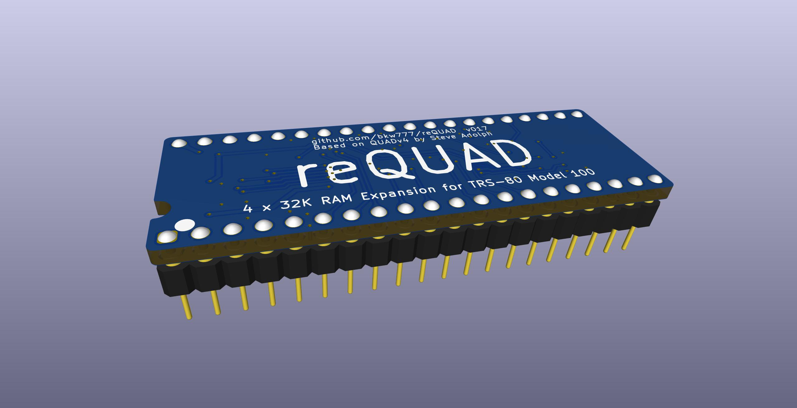
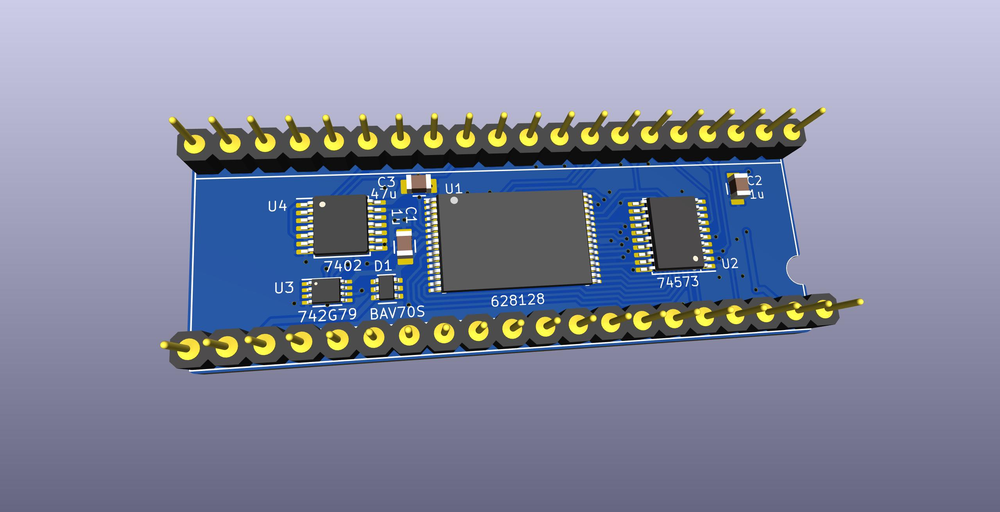
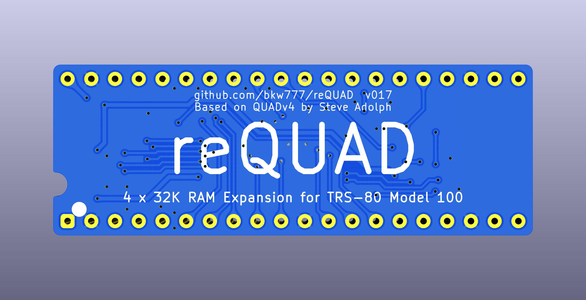
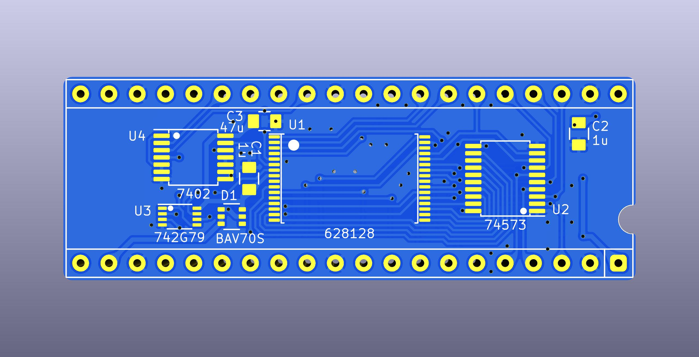

# reQUAD

## About
This is a derivative of [QUAD](http://bitchin100.com/wiki/index.php?title=QUAD) by Steve Adolph.

## Differences from the original
Removed the resistor-cap power-on-reset circuit and resettable flip-flop that tried to ensure that the unit always resets to bank 1.

Instead, the bank-selection flip-flop is a non-resettable type and is kept powered at all times along with the SRAM.  
\[ 2022-10-13: This didn't work as expected. The unit functions well, but seems to always reset to bank 1 at power-on, where it was expected maintain the bank-selection state while on standby. At power-on, you should be in the same bank you were in at power-off. Always resetting to bank 1 would be fine as long as it's certain. That is exactly what the original power-on-reset circuit tried to explicitly ensure. But it is unknown if this can be counted on to happen every time. Perhaps the flip-flop doesn't need to be maintained after all, or perhaps all of the extra logic needs to stay powered instead of just the flip-flop. The unit appears to function correctly otherwise.  \]

New PCB design.

## To Build it
PCB [PCBWAY](https://www.pcbway.com/project/shareproject/reQUAD_RAM_Expansion_for_TRS_80_Model_100_8690cd19.html)  
BOM [DigiKey](https://www.digikey.com/short/vjmw4r5c)

## To Use it
At it's most BASIC (pun intended), the actual low level actions are: switch banks by typing `OUT 128,n` in BASIC, where n is the desired bank number from 0 to 3, and then press the reset button on the back of the machine, but do NOT power-cycle.  

The normal more convenient way to use it is to install the 0QUAD util.

More detail:

`OUT 128,0` switches to bank 1  
`OUT 128,1` switches to bank 2  
`OUT 128,2` switches to bank 3  
`OUT 128,3` switches to bank 4  

But that is only the hardware/electrical part.  
Switching banks is like unplugging all of the ram and then plugging in other ram, *while the machine is running*.  
So you must always also reboot the main rom immediately after any switch, by pressing the reset button.  
Do not power-cycle, only press the reset button. Power-cycle will switch you back to bank 1, or possibly a random bank.

The 0QUAD bank-switch util does the reset for you. You only need to reset manually if you did the OUT command manually, or if you are writing software to switch banks.

The low level / manual method should only be used as part of the one-time initial setup or as a last resort or other unusual special cases.  

You may also do a full cold-reset (CTRL+BREAK+RESET) if you want to wipe the current bank clean, the same as with the normal internal ram. It will only wipe the current bank, not all banks.  

For normal usage, see the directions and software for the original [QUAD](http://bitchin100.com/wiki/index.php?title=QUAD).  

You should use either the simple bank-switch program (BANK.DO) or 0QUAD (QUAD.BA) for normal operation.  

Copies of QUAD.BA and BANK.DO are included in the APP directory.

## Thanks
Steve Adolph for sharing his original design and allowing this derivative.
