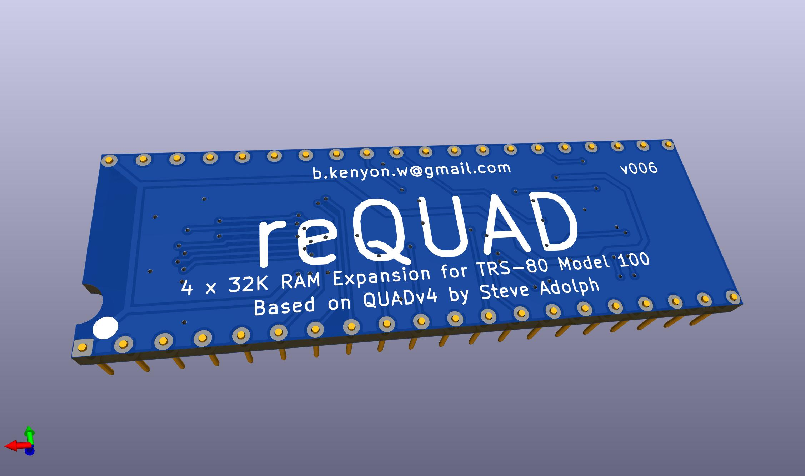
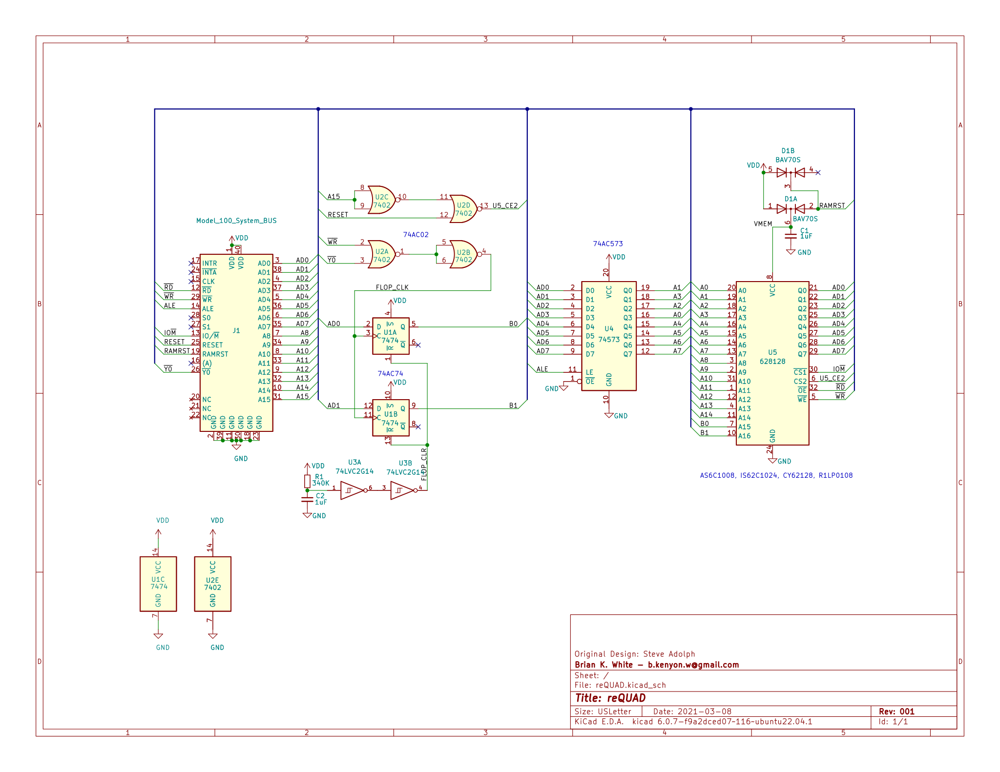

# reQUAD

## About
This is a derivative of [QUAD](http://bitchin100.com/wiki/index.php?title=QUAD) by Steve Adolph.

## Usage
Use the software & directions for the original [QUAD](http://bitchin100.com/wiki/index.php?title=QUAD)

## Thanks
Steve Adolph for sharing his original design and allowing this derivative.
