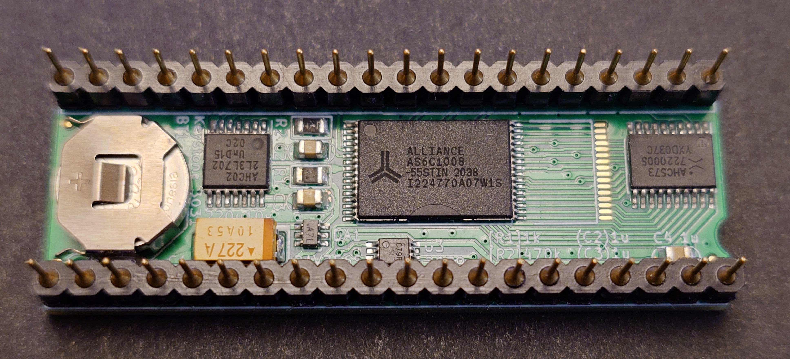
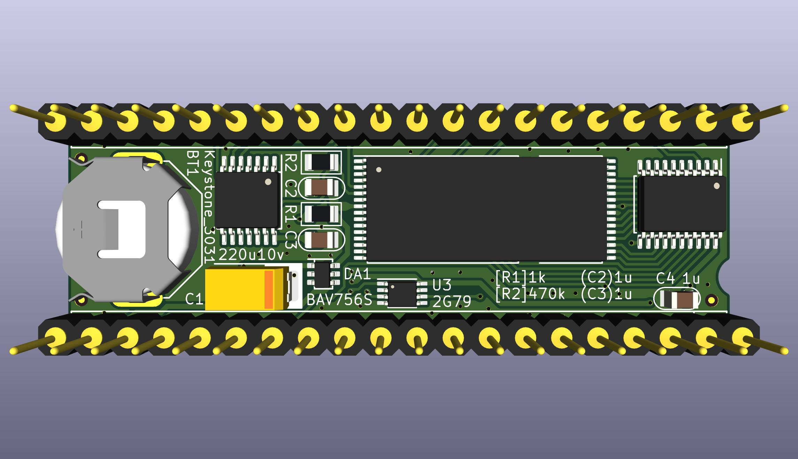
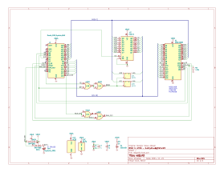

# reQUAD









## About
This is a derivative of [QUAD](http://bitchin100.com/wiki/index.php?title=QUAD) by Steve Adolph.

## Differences from the original
Removed the resistor-cap power-on-reset circuit and resettable flip-flop for a simple flip-flop.  
Added battery and battery-change cap.  
Added pulldown on the sram CE2.

## To Build it
PCB [PCBWAY](https://www.pcbway.com/project/shareproject/reQUAD_RAM_Expansion_for_TRS_80_Model_100_8690cd19.html)  
BOM [DigiKey](https://www.digikey.com/short/z47bn0mw)

Build notes,  
The pin 1 mark on DA1, BAV756S, is tiny and faint, but there is one, you just need a lot of magnification and light. The markings look like `.A7t` and the . is at pin 1. The pinout is not symmetric, and so the part must be installed in the correct orientation.

## To Use it

The device disables and replaces the machine's original internal 32k RAM, so copy any files off of the computer before installing the reQUAD. You won't be able to access the internal ram except by removing the reQUAD.

The first time the device is powered up, it will be in a random bank number.

The first thing you should do after install is "blindly" switch to each bank,  
and do a cold-reset in each bank to wipe all banks of any random data.  
(only cold-reset, not power-cycle. If you power-cycle, the reQUAD may switch to a random bank again.)

In BASIC type `OUT 128,3` \[Enter\], then CTRL+BREAK+RESET.  
In BASIC type `OUT 128,2` \[Enter\], then CTRL+BREAK+RESET.  
In BASIC type `OUT 128,1` \[Enter\], then CTRL+BREAK+RESET.  
In BASIC type `OUT 128,0` \[Enter\], then CTRL+BREAK+RESET.  

Now all 4 banks have been wiped clean of any random data, and you are sitting in bank 1.  
From now on, don't do CTRL+BREAK+RESET any more, just RESET (unless you actually want to wipe a bank).  

Now there are 3 main options for using the banks from no on.  
Manual control,  
BANK.BA,  
0QUAD

### Manual Control

To switch banks manually without 0QUAD or BANK.BA:  
In BASIC, type `OUT 128,n`, where n is the desired bank number from 0 to 3,  
then immediately press RESET on the back of the machine.

`OUT 128,0` switches to bank 1  
`OUT 128,1` switches to bank 2  
`OUT 128,2` switches to bank 3  
`OUT 128,3` switches to bank 4  

The cpu has no knowledge that it's entire ram universe has been replaced and all it's current register contents and pointers and such are invalid, so the main rom must be restarted IMMEDIATELY after the OUT command.

So after the OUT command, ignore the screen and press the RESET button on the back of the machine.

Pressing RESET is only needed when switching manually this way instead of using BANK.BA or 0QUAD.  
BANK.BA and 0QUAD both induce a reset themselves.

### BANK.BA
The next-simplest option for controlling the reQUAD is to copy this 4-line BASIC program into each bank,  
and save it with a name matching the current bank it's in.

First, ensure you are in bank 1:  
In BASIC, type `OUT128,0` \[Enter\], then press RESET.

Then in BASIC type-in this program:
```
1 INPUT"Bank(1-4)";X:IFX<1ORX>4THEN 1
2 A#=0:B=VARPTR(A#):POKEB,249
3 POKEB+1,195:POKEB+2,241:POKEB+3,118
4 CALLB,X-1,30481
```

Then `SAVE "BANK1"`

Now you know you are in bank1 because it says BANK1.BA in the main menu,  
and you can BANK1.BA to switch to any other bank.

Repeat for all 4 banks  
run BANK1.BA, answer "2", you are now in a new empty bank2, type-in the program again, `SAVE "BANK2"`  
run BANK2.BA, answer "3", type-in, `SAVE "BANK3"`  
run BANK3.BA, answer "4", type-in, `SAVE "BANK4"`  

### 0QUAD

Install [0QUAD](APP/)

Refer to the docs for the original [QUAD](http://bitchin100.com/wiki/index.php?title=QUAD)

### Example Installing 0QUAD using dl2 and teeny
(this will wipe all data)

QUAD.BA must be copied as a binary via TPDD, it can't be copied in ascii format using ordinary text transfer with TELCOM.  

This example will use dl2 on the pc to bootstrap install TEENY on the 100, and then use TEENY and dl2 to copy QUAD.BA to the 100.
You can use any other TPDD emulator instead of dl2, like LaddieAlpha or a Backpack, and you can use any TPDD client instead of TEENY, like TS-DOS or DSKMGR.

On the pc, install [dl2](https://github.com/bkw777/dl2/)

On the 100, in BASIC: `OUT 128,0`  
Then do a cold reset: CTRL+BREAK+RESET

On the pc:
```
$ cd APP
$ dl -v -b TEENY.100 && dl -v -u
```

On the 100, in BASIC: `RUN "COM:98N1ENN"`  
Press ENTER at the end of the TEENY install to accept the default install location.  
`CLEAR 0,62213`  
Press F8 to exit to the main menu and run TEENY.CO  
Use TEENY to copy QUAD.BA from the pc  
```
> L QUAD  .BA
> Q
```

On the pc: Ctrl+C to exit dl2

On the 100: Run QUAD.BA  
Answer "1" to the "Which bank are you in?" question.  

0QUAD is now installed in bank 1, but is invisible.

Type `0QUAD` \[Enter\] at the main menu (not in BASIC) to run 0QUAD

Now the top-right corner will show "#1" to show that you are currently in bank 1.  
Press F1 to pull up the bank-switch menu, then press F2 to switch to bank 2.

You are now in bank 2 which is a new empty bank.  
0QUAD is not installed in this bank yet.

Install 0QUAD in bank 2 by repeating everything after the OUT command above, including the cold reset.  
Answer "2" at the "Which bank?" question.  
Repeat again for banks 3 and 4.

Once 0QUAD is installed in all banks, you can use it to switch from any bank to any other bank, and you don't need to press the RESET button after each switch when using 0QUAD to switch.

## Thanks
Thanks to Steve Adolph for sharing his original design and allowing this derivative.
