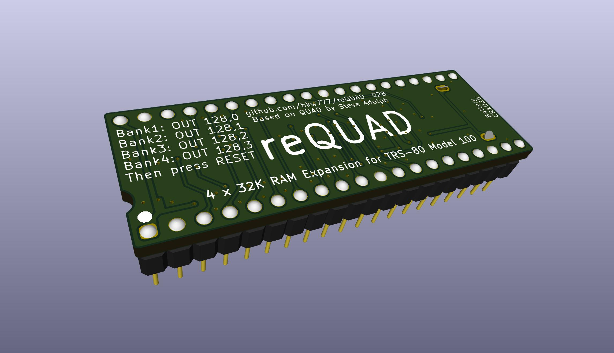
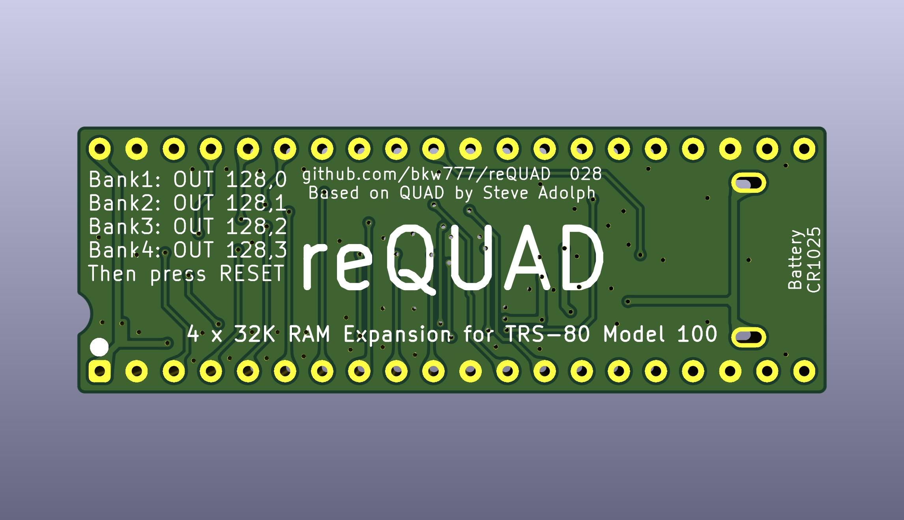
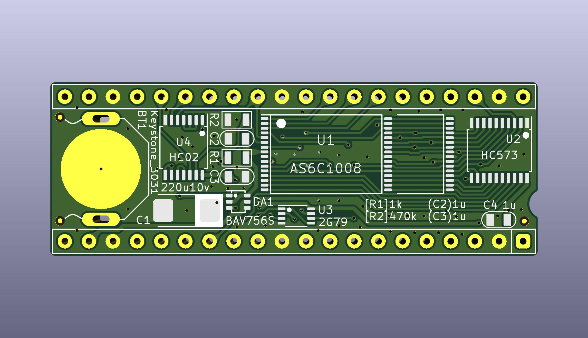

# reQUAD







<!--  -->

## About
This is a derivative of [QUAD](http://bitchin100.com/wiki/index.php?title=QUAD) by Steve Adolph.

## Differences from the original
Removed the resistor-cap power-on-reset circuit and resettable flip-flop for a simple flip-flop.

Added battery and battery-change cap.

Added pulldown on the sram CE2.

## To Build it
PCB [PCBWAY](https://www.pcbway.com/project/shareproject/reQUAD_RAM_Expansion_for_TRS_80_Model_100_8690cd19.html)  
BOM [DigiKey](https://www.digikey.com/short/z47bn0mw)

## To Use it

### Manual Control
Switch banks by typing `OUT 128,n` in BASIC, where n is the desired bank number from 0 to 3,  

`OUT 128,0` switches to bank 1  
`OUT 128,1` switches to bank 2  
`OUT 128,2` switches to bank 3  
`OUT 128,3` switches to bank 4  

And then immediately press the reset button on the back of the machine.

### Software Control
Install [0QUAD](APP/)

Refer to the docs for the original [QUAD](http://bitchin100.com/wiki/index.php?title=QUAD)

Example (linux or mac, and this will wipe all data):

On the pc, install [dl2](github.com/bkw777/dl2)

On the 100. in BASIC: `OUT 128,0`  
Then do a cold reset: CTRL+BREAK+RESET

On the pc:
```
$ cd APP
$ dl -v -b TEENY.100 && dl -v -u
```

On the 100: `RUN "COM:98N1ENN"`  
Press enter at the end of the teeny install to accept the default install location.  
`CLEAR 0,62213`  
Press F8 to exit to the main menu and run TEENY.CO  
Use TEENY to copy QUAD.BA from the pc  
```
> L QUAD  .BA
> Q
```
Run QUAD.BA  
Answer "1" to the "Which bank?" question.  

0QUAD is now installed in bank 1, but is invisible.

Type `0QUAD` right at the main menu (not in BASIC), to run the invisible 0QUAD

Now the top-right corner will show "#1" to show that you are currently in bank 1.  
Press F1 to pull up the bank-switch menu, press F2 to switch to bank 2.

You are now in bank 2 which is a new bank of new blank ram.

Repeat everything above after the initial OUT command (meaning don't do the OUT command, but do do the ctrl+break+reset) to install 0QUAD in this bank and then use it to move on to banks 3 & 4.

## Thanks
Steve Adolph for sharing his original design and allowing this derivative.
